# 💻 Digital Banking App – Angular Frontend

Ce dépôt contient une **application frontend Angular** conçue pour interagir avec un **backend Spring Boot**. Ce projet est réalisé dans le cadre du cours **"Architecture JEE et Middlewares"** dirigé par **Mr YOUSSFI Mohamed**, et a pour objectif la mise en œuvre d’une application de **gestion des comptes bancaires** (clients, comptes courants/épargnes, opérations DEBIT/CREDIT).

## 🎯 Objectif

Développer une application web complète permettant :

- La gestion des **clients** (ajout, édition, suppression, recherche).
- La gestion des **comptes bancaires** (comptes courants et épargnes).
- La consultation des **opérations bancaires** (DEBIT/CREDIT).
- L’affichage de statistiques dans un **dashboard** avec **ng-chart** (Chart.js).
- La **sécurisation** de l’accès via **Spring Security** et **JWT**.

## 📚 Ressources pédagogiques

- 🎥 [Présentation du projet](https://www.youtube.com/watch?v=x6gFWmRxNPE&authuser=0)  
- 🧩 Partie Backend :
  - [Création du backend Spring Boot - Partie 1](https://www.youtube.com/watch?v=muuFQWnCQd0&authuser=0)
  - [Création du backend - Partie 2](https://www.youtube.com/watch?v=PTI8cniOXLc)
- 💡 Partie Frontend Angular :  
  - [Frontend Angular](https://www.youtube.com/watch?v=bOoPKctcE0s)
- 🔐 Sécurité Spring Security + JWT :  
  - [JWT avec Spring Security](https://www.youtube.com/watch?v=n65zFfl9dqA)

---

## 🧱 Structure de l’application

### 🔹 Frontend Angular

- **Home** : Page d’accueil.
- **Clients** : Gestion complète des clients.
- **Accounts** : Liste des comptes courants et épargnes.
- **Operations** : Visualisation des opérations DEBIT/CREDIT par compte.
- **Dashboard** : Graphiques et statistiques via `ng-chart`.
- **Security** : Authentification avec JWT et gestion des utilisateurs.

### 🔹 Backend Spring Boot

- Entités JPA : `Customer`, `BankAccount`, `SavingAccount`, `CurrentAccount`, `AccountOperation`
- Repositories Spring Data JPA
- Couche Service avec DTOs
- API REST sécurisée via Spring Security + JWT
- Documentation Swagger UI (Spring Boot 3)
  

### 🔐 Sécurité – Spring Security + JWT

L'application est désormais sécurisée avec **Spring Security** et **JWT**. Deux rôles principaux sont pris en charge :

- `ADMIN` : Accès total à toutes les fonctionnalités (gestion des utilisateurs, comptes, etc.)
- `USER` : Accès restreint (consultation des comptes et opérations personnelles uniquement)

---

## 📸 Captures d'écran – Sécurité et Rôles

---
#### 🔐 Authentification
| Formulaire de Connexion | Formulaire d’Inscription |
|---|---|
|  |  |

---
### ✅ Connexion réussie – Token JWT stocké

Connexion réussie avec stockage du token JWT dans le navigateur (LocalStorage).

| 🔓 Authentification Réussie | Home User | Home Admin
|---|---|---|
| 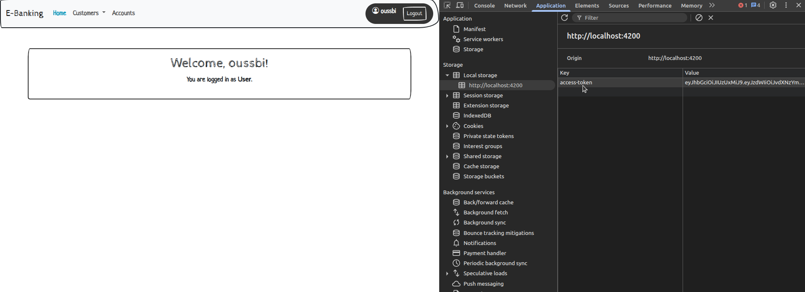 |  |  |

---

### ❌ Accès refusé – Rôle non autorisé

Tentative d'accès à une page réservée à l'`ADMIN` par un utilisateur avec le rôle `USER`.

| ❌ Accès Refusé |
|---|
| 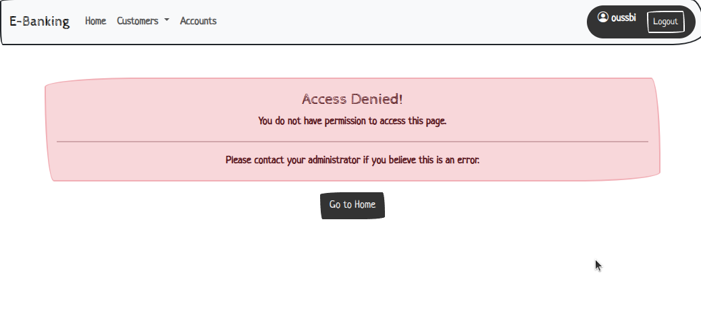 |

---

### 🕒 Expiration du Token JWT

Une fois le token expiré, l'utilisateur est automatiquement redirigé vers la page de connexion.

| 🕒 Token Expiré |
|---|
| 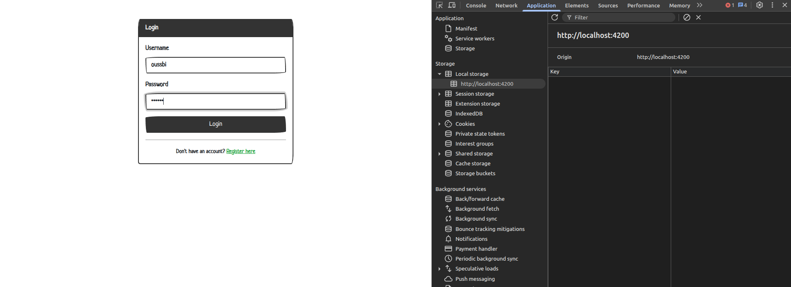 |

---

## 🔐 Sécurisation des APIs

Toutes les routes sensibles sont protégées côté backend. Exemple :

- `/admin/**` : réservé à l’`ADMIN`
- `/user/**` : accessible à l’`ADMIN` et au `USER`
- `/auth/**` : accès public (connexion, inscription)

---

#### 👥 Gestion des Clients

### ADMIN

| Liste des Clients | Détails d’un Client | Formulaire d’ajout |
|---|---|---|
| 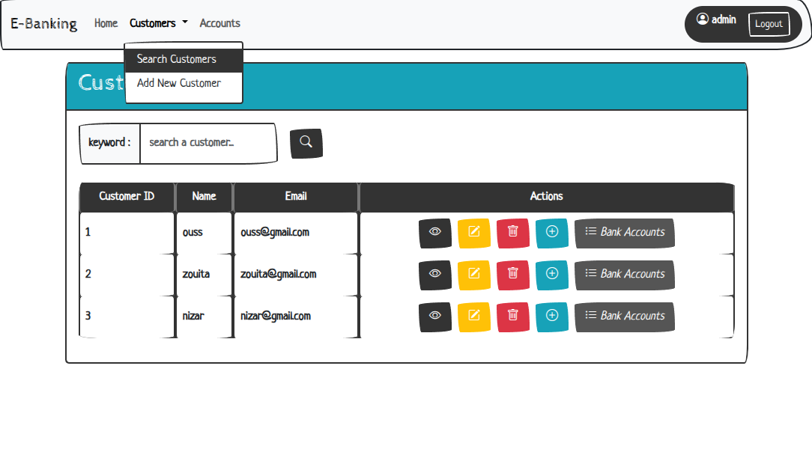 | 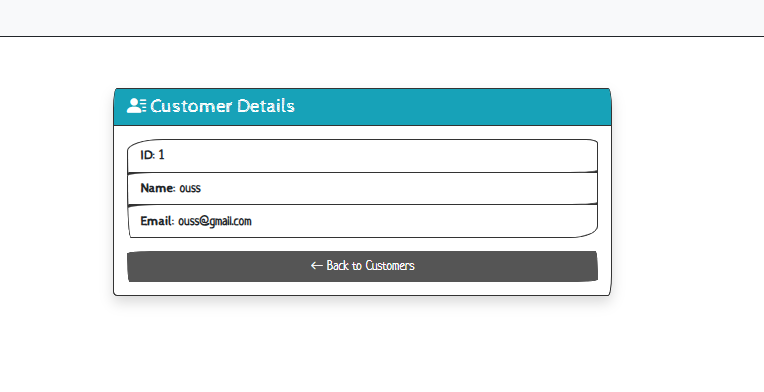 | 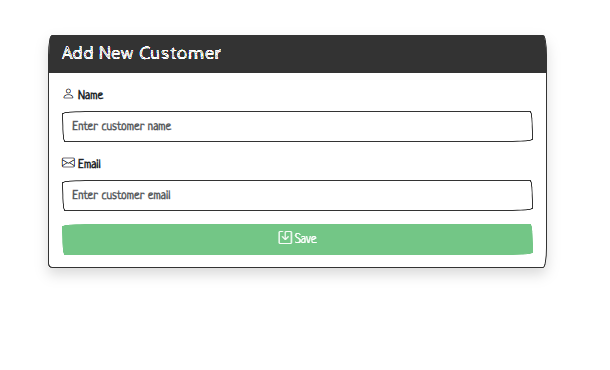 |

### USER

| Liste des Clients | Détails d’un Client | 
|---|---|---|
| 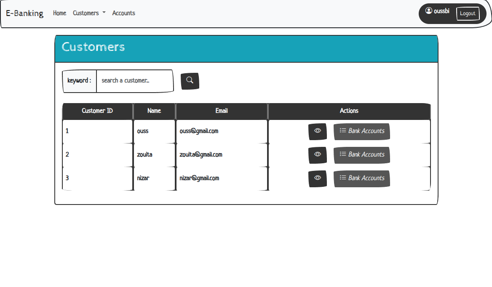 |  |

---

#### 🏦 Gestion des Comptes

### ADMIN

| Liste des Comptes | Détails d’un Compte Courant | Détails d’un Compte Épargne |
|---|---|---|
| 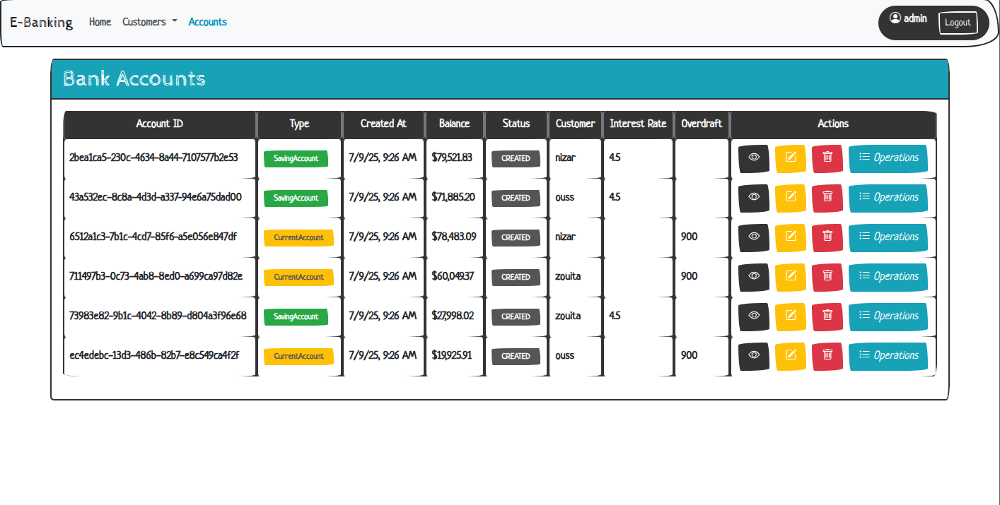 | 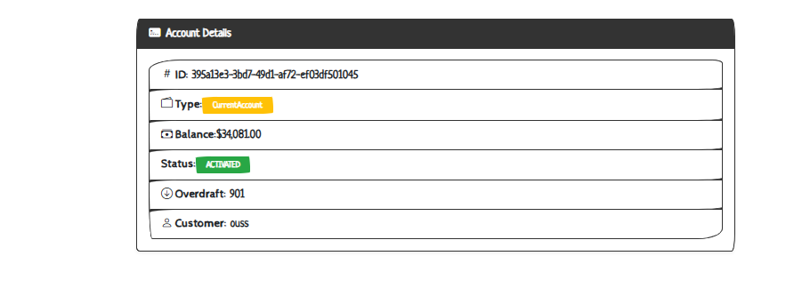 | 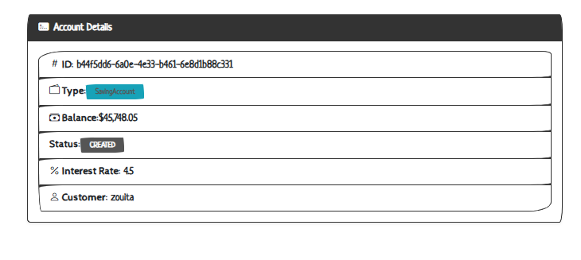 |

### USER

| Liste des Comptes | Détails d’un Compte Courant | Détails d’un Compte Épargne |
|---|---|---|
| 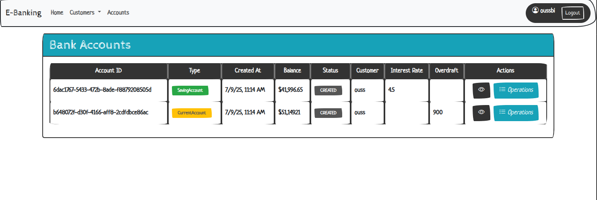 |  |  |

---

#### 💳 Opérations Bancaires

### ADMIN
| Historique des Opérations | Débit avant | Débit après | 
|---|---|---|
| 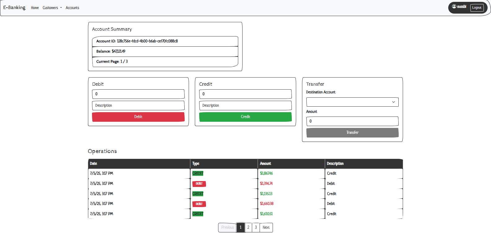 | 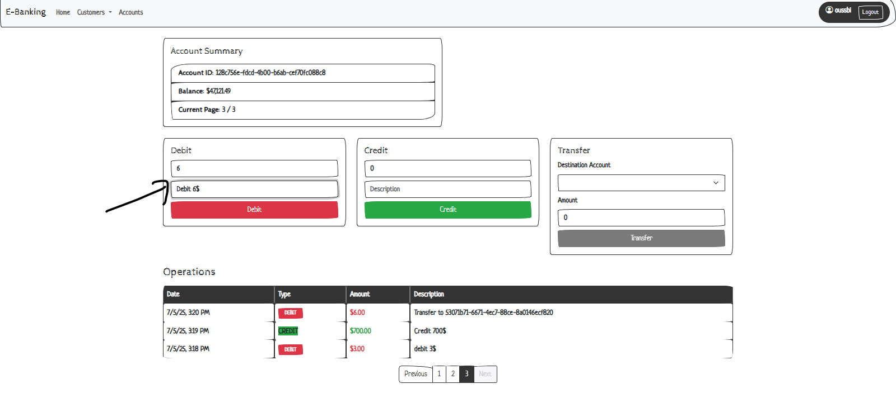 | 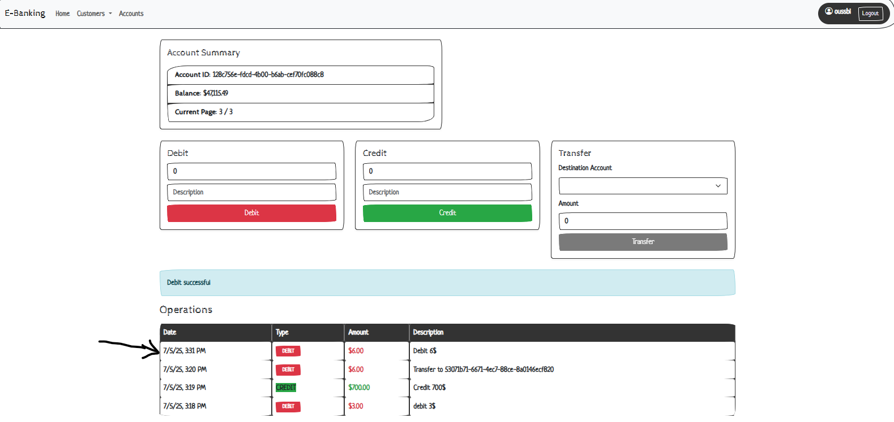 |

| Transfer Liste | Transfer | 
|---|---|
| 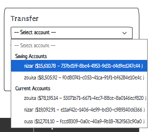 | 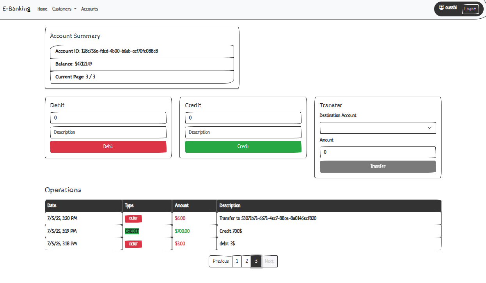 |

### USER
| Historique des Opérations | 
|---|
| 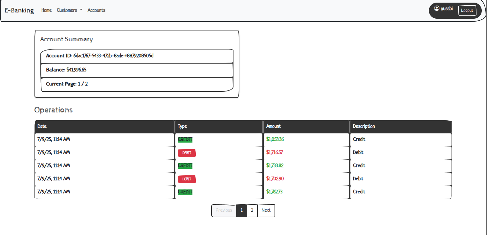 |

---
<!--
#### 🧑‍💼 Encadrant
Pr. YOUSSFI Mohamed

#### 👨‍🏫 Auteur
BISSI Oussama
-->
